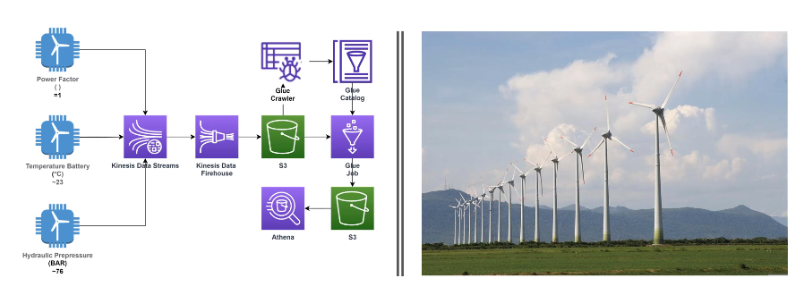

# WindFarm
## A wind farm engineering data pipeline simulation

The objective of this project is to create a data engineering pipeline using AWS tools.

We will simulate a wind farm, where each of the wind turbines will periodically send information about its temperature, hydraulic pressure, and power.

Our application will receive this data through Kinesis, save it in an S3 bucket, and use Glue to infer its tabular structure, enabling the use of queries with Athena.

In a real scenario, an application like this could be useful for monitoring wind turbine performance, anticipating potential issues, and the data collected could serve as input for a possible machine learning model.
